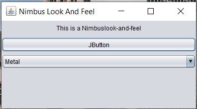

# CinamaHallPieces
Pieces of the Cinema Hall Management Application. They are later to be integrated to a single application.
The CinameHall seat selection shall be redeveloped and so far looks like the one on the screenshot. When user hoverovers the mouse
pointer, seat turns green.

I like the Java's Nimbus look and feel. So, the Movie Theater app will be by default on Nimbus. And, here is the screenshot of the basic Frame with this particular look-and-feel (NimbusFrame.java).

