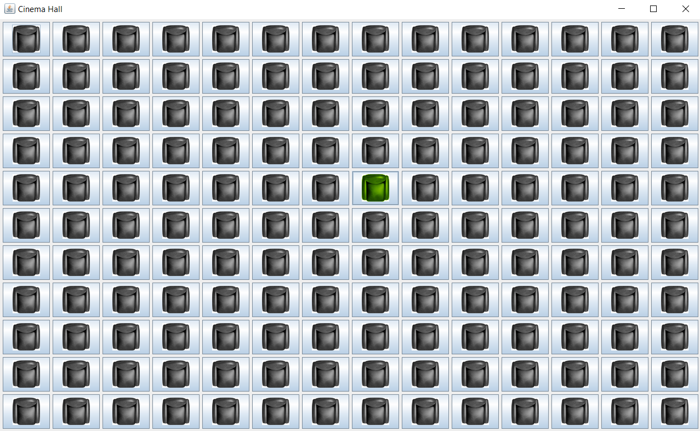

# CinamaHallPieces
Pieces of the Cinema Hall Management Application. They are later to be integrated to a single application.
The CinameHall seat selection shall be redeveloped and so far looks like the one on the screenshot. When user hoverovers the mouse
pointer, seat turns green.

I like the Java's Nimbus look and feel. So, the Movie Theater app will be by default on Nimbus. 
And, here is the screenshot of the basic Frame with this particular look-and-feel (NimbusFrame.java).

# Two panels for button action

In this screenshot below, you can see a list of buttons that play a role of movie sessions later to be changed where
the user clicks one of the button, the right panel in this time just does single action, which is changing the label color
but, in future, based on which button clicked, right panel will display the movie theater seats alignment so that
user can pick a seat for the visitor

# Movie Theatre general layout of the window

The screenshot below, shows general layout of the movie theatre application. Left side will list movies, middle allows to pick,
and right side for receipt info.

# Main Window layout

This JFrame shows the layout of main window of the movie theatre application. The top compartment will hold the session to pick 
form combo box. Middle to pick seat, and bottom has save to save picked seat and receipt to display price etc info.

